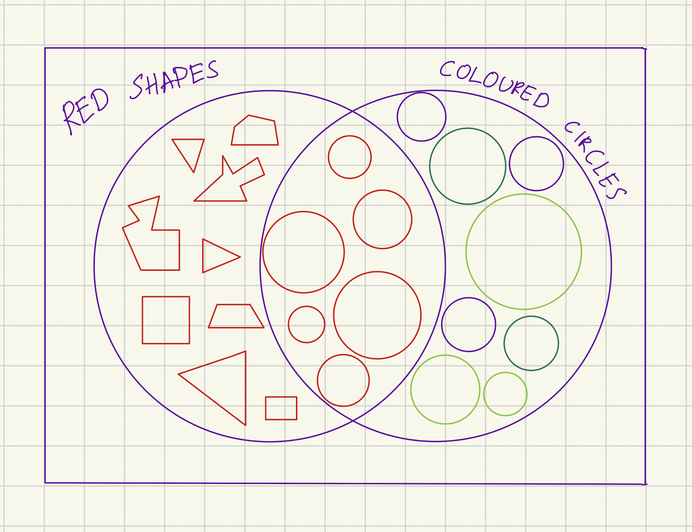

[category]: <> (Math)
[date]: <> (2024/09/18)
[title]: <> (Necessary and Sufficient Conditions)
[pandoc]: <> (--mathjax)

## introduction

Necessary and sufficient conditions are fundamental concepts in logic, mathematics, and many other fields of study. They provide a framework for precise reasoning and help us understand the relationships between different statements or properties. This article will explore these concepts from both set theory and logical perspectives, demonstrating their importance and practical applications.

## set theory perspective

Let's start with a set view of these concepts. Have a look at the following diagram. We have contrived a universe in which a _red circle_ is a combination of a _red shape_ and a _coloured circle_.

To be a _red circle_, it is **necessary** to be a _red shape_. But not **sufficient**! (because you might be a _red square_ or any other _non-circle red shape_)

Similarly, to be a _red circle_, it is **necessary** to be a _coloured circle_. But not **sufficient**! (because it could be a blue circle or any other non-red colored circle)

Conversely, being a _red circle_ is a **sufficient** condition for being both a _red shape_ and a _coloured circle_. Knowing that a shape is a _red circle_ guarantees that it is a _red shape_ and that it is a _coloured circle_.

Also, to be both a _red shape_ and a _coloured circle_ is a **necessary** and **sufficient** condition for being a _red circle_. Meaning they are **the same** conditions (_red shape_ and _coloured circle_ $\iff$ _red circle_).

You can extend this thinking to an arbitrary number of sets to get an even better understanding of **necessary** conditions. For example, have a look at the following diagram.

Clearly, now there are 3 **necessary** conditions if we are talking about the letters that are common among all the sets. This reasoning, of course, extends to an arbitrary number of **necessary** conditions.

> Intuition takeaway from this section: you can have many **necessary** conditions, that all are _individually_ required, but also they _individually_ do not guarantee the final outcome. On the other hand, if something is a **sufficient** condition, you know immediately that it guarantees the final outcome.

Feel free to stop here as this will already give you a solid basic understanding of the concepts. However, if you want to look at these conditions from a logic perspective, continue reading.

## logic perspective

Unless you are very comfortable with material conditional (implication, which is a logical relationship between two statements where if the first is true, the second must also be true), I highly recommend reading <a href="/implication" target="_blank" rel="noopener noreferrer">my other post on the topic</a>.

In logic, we express **necessary** and **sufficient** conditions using implications. Let's revisit our earlier example from a logical standpoint.

In logic, the statement "_P is a necessary condition for Q_" means that $P$ cannot be true unless $Q$ is true, which is expressed as:

$$ P \Leftarrow Q $$

This symbol $\Leftarrow$ is read as "is implied by" or "if and only if".

Conversely, "_P is a sufficient condition for Q_" means that whenever $P$ is true, $Q$ is also true:

$$ P \Rightarrow Q $$

This symbol $\Rightarrow$ is read as "implies" or "if...then".

Now, let's apply this knowledge to the above example we have contrived. First, let's define our propositions. We will be a little unconventional and denote events with two letters instead of one. There is no significance in this, other than making it instantaneous to understand what proposition we have in mind just by looking at the letters:

- Let $RC$ be the proposition "_It is a red circle_".
- Let $RS$ be the proposition "_It is a red shape_".
- Let $CC$ be the proposition "_It is a coloured circle_".

From our set-theoretic perspective, we know that:

1. **Being a red shape is necessary for being a red circle**. In logic, this is expressed as:

   $$ RS \Leftarrow RC $$

   This means that if something is a red circle ($RC$ is true), then it must be a red shape ($RS$ is true).

2. Similarly, **being a coloured circle is necessary for being a red circle**:

   $$ CC \Leftarrow RC $$

3. **Being a red circle is sufficient for being a red shape**. This is the same implication as in (1) above:

   $$ RC \Rightarrow RS $$

   Here, $RC$ being true guarantees that $RS$ is true.

4. **Being both a red shape and a coloured circle is necessary and sufficient for being a red circle**. This is expressed as:

   $$ RC \Leftrightarrow RS \land CC $$

   This means that $RC$ is true if and only if both $RS$ and $CC$ are true.

   You can denote $RS \land CC$ with a single letter, like $C$ to make the above statement appear more conventionally, then you have $RC \Leftrightarrow C$.

## why is it important?

Understanding necessary and sufficient conditions is crucial in mathematics and many other fields because they form the foundation of logical reasoning and proof construction. These concepts help us:

- **Clarify definitions**: they allow us to define concepts precisely by specifying exactly what is required (necessary conditions) and what is enough (sufficient conditions) for a statement to be true.

- **Develop theorems and proofs**: many mathematical theorems are structured around necessary and sufficient conditions. Recognizing these conditions aids in both proving new theorems and understanding existing ones.

- **Solve complex problems**: breaking down problems into necessary and sufficient conditions can simplify complex scenarios, making them more manageable and easier to solve.

For example, in medicine, understanding necessary and sufficient conditions can be crucial for diagnosis. A certain symptom might be necessary for a diagnosis (the disease cannot be present without it) but not sufficient (the symptom alone doesn't guarantee the disease). On the other hand, a positive result from a highly specific test might be both necessary and sufficient for diagnosing a particular condition.

In computer science, necessary and sufficient conditions are often used in algorithm design and verification. For instance, in sorting algorithms, certain conditions might be necessary for an array to be considered sorted, while others might be sufficient to guarantee that the sorting process is complete.

## exercises

Want to test your understanding? Try to solve these exercises before checking the answers below. These questions will help you apply the concepts of necessary and sufficient conditions to various scenarios.

1. **Identifying Conditions**:

   a) Is being a mammal a necessary or sufficient condition for being a human?

   b) Is being a square a necessary or sufficient condition for being a rectangle?

2. **Logical Implications**:

   Let $P$ be "It is a bird," and $Q$ be "It can fly."

   a) Is $P$ a sufficient condition for $Q$?

   b) Is $Q$ a necessary condition for $P$?

3. **Set Theory Application**:

   Given sets $A$, $B$, and $C$ such that $A \subseteq B$ and $B \subseteq C$.

   a) Is being an element of $A$ a sufficient condition for being an element of $C$?

   b) Is being an element of $C$ a necessary condition for being an element of $A$?

4. **Combining Conditions**:

   If being enrolled in a university course requires both paying tuition and registering for classes, are these conditions necessary, sufficient, or both for enrollment?

5. **Real-Life Scenario**:

   Consider the statement: "Having a key is sufficient to open the door."

   a) Is having a key a necessary condition to open the door?

   b) Explain why or why not.

## answers

1. **Identifying Conditions**:

   a) **Necessary Condition**: Being a mammal is necessary for being a human, but not sufficient (since not all mammals are humans).

   b) **Sufficient Condition**: Being a square is sufficient for being a rectangle, but not necessary (since rectangles can be non-square).

2. **Logical Implications**:

   a) **Not Sufficient**: Being a bird is not a sufficient condition for being able to fly (e.g., ostriches and penguins are birds that cannot fly).

   b) **Not Necessary**: Being able to fly is not a necessary condition for being a bird (as above, some birds cannot fly).

3. **Set Theory Application**:

   a) **Sufficient Condition**: Yes, if an element is in $A$, it is sufficient to say it is in $C$ because $A \subseteq C$.

   b) **Necessary Condition**: Yes, being in $C$ is necessary for being in $A$ since all elements of $A$ are contained in $C$. However, it's important to note that while being in $C$ is necessary for being in $A$, it's not sufficient (as there might be elements in $C$ that are not in $A$).

4. **Combining Conditions**:

   Both paying tuition and registering for classes are **necessary** conditions for enrollment. Together, they are **sufficient** conditions.

5. **Real-Life Scenario**:

   a) **Not Necessary**: Having a key is not a necessary condition to open the door (the door could be opened by other means, like someone else opening it from the inside).

   b) **Explanation**: While a key is one way to open the door (sufficient condition), it's not the only way (not necessary). Other methods might include using a keypad code or having someone else open it.

## references and further reading

1. <a href="https://www.rationalrealm.com/philosophy/logic/propositional-logic-primer-page3.html" target="_blank" rel="noopener noreferrer">Propositional Logic Primer: Deduction</a>

2. Hurley, P. J. (2014). A Concise Introduction to Logic. Cengage Learning.

3. Velleman, D. J. (2006). How to Prove It: A Structured Approach. Cambridge University Press.

4. <a href="https://plato.stanford.edu/entries/necessary-sufficient/" target="_blank" rel="noopener noreferrer">Stanford Encyclopedia of Philosophy: Necessary and Sufficient Conditions</a>

5. <a href="https://math.stackexchange.com/questions/tagged/necessary-sufficient-conditions" target="_blank" rel="noopener noreferrer">Mathematics Stack Exchange: Discussions on Necessary and Sufficient Conditions</a>

These resources provide deeper insights into the concepts of necessary and sufficient conditions, their applications in various fields, and more advanced topics in logic and mathematical reasoning.
