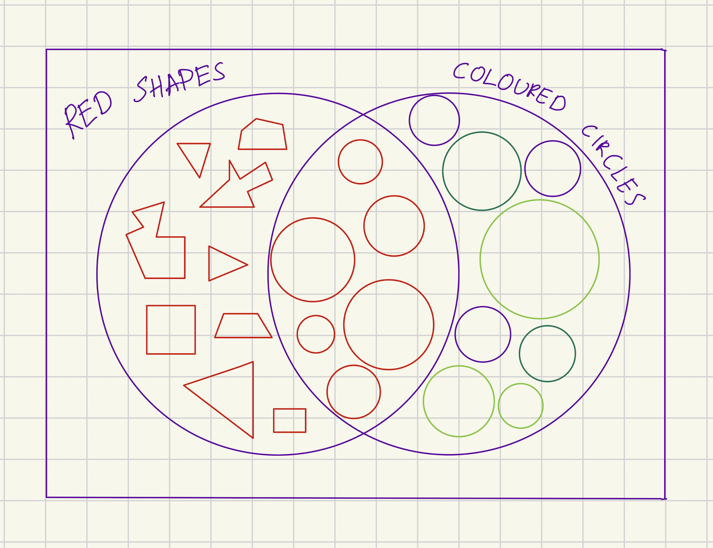
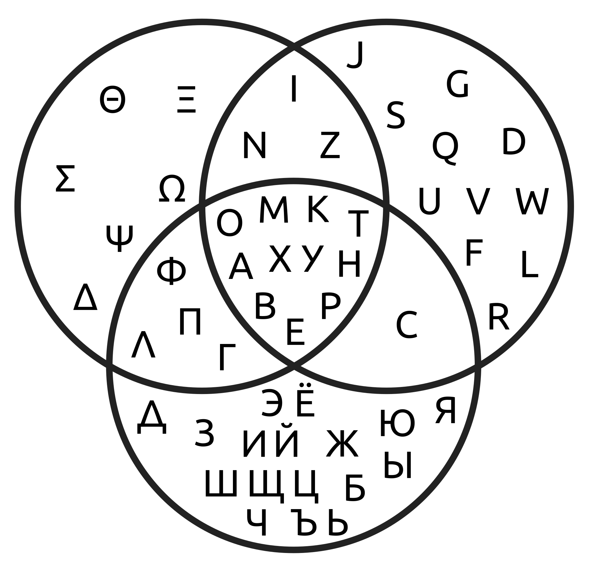

[category]: <> (Math)
[date]: <> (2024/09/18)
[title]: <> (Necessary and Sufficient Conditions)
[pandoc]: <> (--mathjax)

Oftentimes, there is considerable confusion when the concepts of **necessary** and **sufficient** conditions are taught. This article aims to make a clear exposition of these concepts from two points of view: that of set theory and logical implications.

## definitions

Let's start by considering precise definitions. You don't need to learn these. My hope is that by the end of this post, they will become natural to you. But it is useful to keep these in mind, before we set off.

> Event $P$ is said to
> be a **sufficient** condition for event $Q$:   whenever
> the occurrence of $P$ is all that is required for the
> occurrence of $Q$.    
> On the other hand,    Event $P$ is said
> to be a **necessary** condition for event $Q$:   whenever $Q$ cannot occur without the occurrence of $P$.

## set theory perspective

Let's start with a set view of these concepts. Have a look at the following diagram. We have contrived a universe in which a _red circle_ is a combination of a _red shape_ and a _coloured circle_.

To be a _red circle_, it is **necessary** to be a _red shape_. But not **sufficient**! (because you might be a _red square_ or any other _non-circle red shape_)

Similarly, to be a _red circle_, it is **necessary** to be a _coloured circle_. But not **sufficient**! (because it could be a blue circle or any other non-red colored circle)

Conversely, being a _red circle_ is a **sufficient** condition for being both a _red shape_ and a _coloured circle_. Knowing that a shape is a _red circle_ guarantees that it is a _red shape_ and that it is a _coloured circle_.

Also, to be both a _red shape_ and a _coloured circle_ is a **necessary** and **sufficient** condition for being a _red circle_. Meaning they are **the same** conditions (_red shape_ and _coloured circle_ $\iff$ _red circle_).

You can extend this thinking to an arbitrary number of sets to get an even better understanding of **necessary** conditions. For example, have a look at the following diagram.

Clearly, now there are 3 **necessary** conditions if we are talking about the letters that are common among all the sets. This reasoning, of course, extends to an arbitrary number of **necessary** conditions.

> Intuition takeaway from this section: you can have many **necessary** conditions, that all are _individually_ required, but also they _individually_ do not guarantee the final outcome. On the other hand, if something is a **sufficient** condition, you know immediately that it guarantees the final outcome.

Feel free to stop here as this will already give you a solid basic understanding of the concepts. However, if you want to look at these conditions from a logic perspective, continue reading.

## logic perspective

Unless you are very comfortable with material conditional, I highly recommend reading <a href="/implication" target="_blank" rel="noopener noreferrer">my other post on the topic</a>.

Let's begin by looking at the truth table of the material conditional:

| $P$ | $Q$ | $P \Rightarrow Q$ |
| --- | --- | ----------------- |
| T   | T   | T                 |
| T   | F   | F                 |
| F   | T   | T                 |
| F   | F   | T                 |

Strike out the row where implication is false, since we are only concerned with the true implications.

| $P$ | $Q$ | $P \Rightarrow Q$ |         |
| --- | --- | ----------------- | ------- |
| T   | T   | T                 | (row 1) |
|     |     |                   |         |
| F   | T   | T                 | (row 3) |
| F   | F   | T                 | (row 4) |

> The fact that $Q$ is true in every row where $P$ is true (i.e., row 1) tells us that $P$ is sufficient for $Q$.    
> The fact that $P$ is false in every row where $Q$ is false (i.e., row 4) tells us that $Q$ is necessary for $P$. [^1]

[^1]: ryang (https://math.stackexchange.com/users/21813/ryang), Interpreting sufficiency and necessity from the truth table, URL (version: 2024-09-21): https://math.stackexchange.com/q/4974479

Alternatively and equivalently:

> When $P \Rightarrow Q$ is true, then $P$ is only true when $Q$ is true, although $P$ may be false when $Q$ is true. So $Q$ is necessary for $P$, but not sufficient.    
> When $P \Rightarrow Q$ is true, then $Q$ is always true whenever $P$ is true, although $Q$ may be true if $P$ is false. So $P$ is sufficient for $Q$, but not necessary. [^2]

[^2]: Graham Kemp (https://math.stackexchange.com/users/135106/graham-kemp), Interpreting sufficiency and necessity from the truth table, URL (version: 2018-01-27): https://math.stackexchange.com/q/2623453

A nice heuristic for remembering the direction of the arrow:

$$sufficient => necessary$$

so if we have conventional form:

$$P \Rightarrow Q$$

then we can read it as:

P is sufficient for Q

Q is necessary for P

These two statements are equivalent. If, however, we stated that $P$ is sufficient for $Q$ and $P$ is necessary for $Q$, then we would have a biconditional statement, which would mean that both are either true or both are false.

Now, let's apply this knowledge to an earlier example we have contrived about red circles. First, let's define our propositions. We will be a little unconventional and denote events with two letters instead of one. There is no significance in this, other than making it instantaneous to understand what proposition we have in mind just by looking at the letters:

- Let $RC$ be the proposition "_It is a red circle_".
- Let $RS$ be the proposition "_It is a red shape_".
- Let $CC$ be the proposition "_It is a coloured circle_".

From our set-theoretic perspective, we know that:

1. **Being a red shape is necessary for being a red circle**.

   $$ RS \Leftarrow RC $$

   This means that if something is a red circle ($RC$ is true), then it must be a red shape ($RS$ is true).

2. Similarly, **being a coloured circle is necessary for being a red circle**:

   $$ CC \Leftarrow RC $$

3. **Being a red circle is sufficient for being a red shape**. This is the same implication as in (1) above:

   $$ RC \Rightarrow RS $$

   Here, $RC$ being true guarantees that $RS$ is true.

4. **Being both a red shape and a coloured circle is necessary and sufficient for being a red circle**. This is expressed as:

   $$ RC \Leftrightarrow RS \land CC $$

   This means that $RC$ is true if and only if both $RS$ and $CC$ are true.

## why is it important?

A few practical examples are in order.

In medicine, understanding necessary and sufficient conditions can be crucial for diagnosis. A certain symptom might be necessary for a diagnosis (the disease cannot be present without it) but not sufficient (the symptom alone doesn't guarantee the disease). On the other hand, a positive result from a highly specific test might be both necessary and sufficient for diagnosing a particular condition.

In computer science, necessary and sufficient conditions are often used in algorithm design and verification. For instance, in sorting algorithms, certain conditions might be necessary for an array to be considered sorted, while others might be sufficient to guarantee that the sorting process is complete.

## exercises

Want to test your understanding? Have a go at each one before unfolding the answer underneath it.

1. **Identifying Conditions**:

   a) Is being a mammal a necessary or sufficient condition for being a human?

   b) Is being a square a necessary or sufficient condition for being a rectangle?

   

show answer

   a) **Necessary**: being a mammal is necessary for being a human, but not sufficient (since not all mammals are humans).

   b) **Sufficient**: being a square is sufficient for being a rectangle, but not necessary (since rectangles can be non-square).

   

2. **Logical Implications**:

   Let $P$ be "It is a bird," and $Q$ be "It can fly."

   a) Is $P$ a sufficient condition for $Q$?

   b) Is $Q$ a necessary condition for $P$?

   

show answer

   a) **Not sufficient**: being a bird does not guarantee flight -- ostriches and penguins are birds that cannot fly.

   b) **Not necessary**: flight is not required in order to be a bird, for the same reason.

   Both parts are the same fact seen from two sides: $P \Rightarrow Q$ is simply false here, and "$P$ is sufficient for $Q$" and "$Q$ is necessary for $P$" are two readings of that one implication. A single counterexample -- one flightless bird -- kills both at once.

   

3. **Set Theory Application**:

   Given sets $A$, $B$, and $C$ such that $A \subseteq B$ and $B \subseteq C$.

   a) Is being an element of $A$ a sufficient condition for being an element of $C$?

   b) Is being an element of $C$ a necessary condition for being an element of $A$?

   

show answer

   Subset inclusion is transitive, so $A \subseteq B$ and $B \subseteq C$ give $A \subseteq C$.

   a) **Sufficient**: yes. $x \in A \Rightarrow x \in C$.

   b) **Necessary**: yes -- and again it is the *same* implication, read right to left. $A$ cannot have an element that $C$ lacks.

   Note that being in $C$ is necessary but not sufficient for being in $A$: $C$ may well contain elements that are outside $A$.

   

4. **Combining Conditions**:

   If being enrolled in a university course requires both paying tuition and registering for classes, are these conditions necessary, sufficient, or both for enrollment?

   

show answer

   Write $E$ for "enrolled", $T$ for "paid tuition" and $R$ for "registered".

   Each is **necessary**: "requires" tells us $E \Rightarrow T \land R$, so neither can be skipped.

   Whether the two together are **sufficient** does not follow from the word "requires" -- and this is the trap. "$X$ requires $Y$" only ever gives you necessity. To also get sufficiency you need the converse, $T \land R \Rightarrow E$, which is an extra claim about the university's rules. In practice there may be further hurdles (prerequisites, a place left on the course), in which case the conditions are necessary but *not* sufficient.

   If the two conditions really are the whole story, then together they are necessary and sufficient, and enrollment is a biconditional, $E \Leftrightarrow T \land R$ -- the same shape as $RC \Leftrightarrow RS \land CC$ from earlier.

   

5. **Real-Life Scenario**:

   Consider the statement: "Having a key is sufficient to open the door."

   a) Is having a key a necessary condition to open the door?

   b) Explain why or why not.

   

show answer

   a) **Not necessary** -- or more precisely, the statement given does not tell us either way.

   b) "Having a key is sufficient" asserts only $\text{key} \Rightarrow \text{opens}$. Necessity would be the converse, $\text{opens} \Rightarrow \text{key}$, and asserting one direction never gets you the other. In the world as we know it the converse is false, since a keypad code, a locksmith, or someone opening it from the inside all work without a key.

   This is the single most common error with these conditions: hearing "sufficient" and quietly also concluding "necessary". A sufficient condition names *one* way to reach the outcome, never the *only* way.

   

## references and further reading

1. <a href="https://www.rationalrealm.com/philosophy/logic/propositional-logic-primer-page3.html" target="_blank" rel="noopener noreferrer">Propositional Logic Primer: Deduction</a>

2. Hurley, P. J. (2014). A Concise Introduction to Logic. Cengage Learning.

3. <a href="https://plato.stanford.edu/entries/necessary-sufficient/" target="_blank" rel="noopener noreferrer">Stanford Encyclopedia of Philosophy: Necessary and Sufficient Conditions</a>

4. <a href="https://math.stackexchange.com/questions/tagged/necessary-sufficient-conditions" target="_blank" rel="noopener noreferrer">Mathematics Stack Exchange: Discussions on Necessary and Sufficient Conditions</a>

5. <a href="https://www.ncl.ac.uk/webtemplate/ask-assets/external/maths-resources/economics/sets-and-logic/necessity-and-sufficiency.html#External%20Resources" target="_blank" rel="noopener noreferrer">Newcaslte University: Necessary and Sufficient Conditions</a>
