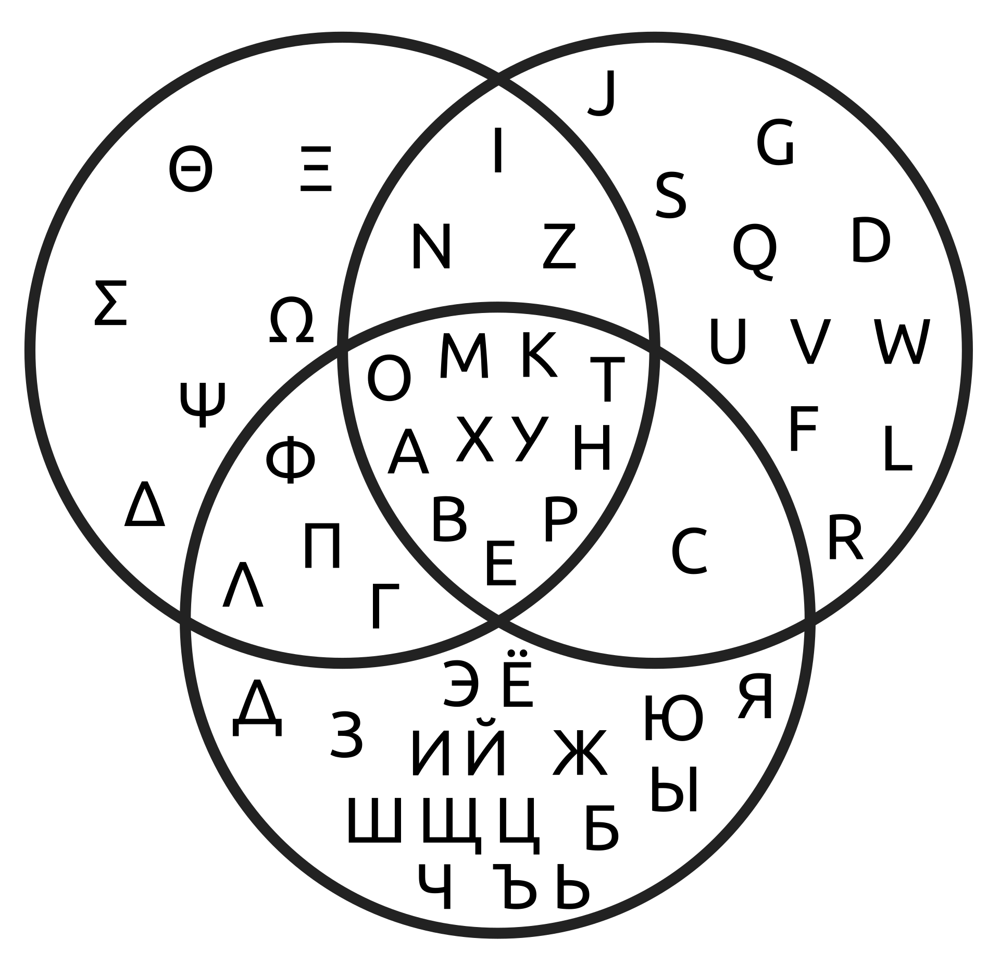

[category]: <> (Math)
[date]: <> (2024/09/14)
[title]: <> (Necessary and sufficient conditions in mathematics)
[pandoc]: <> (--mathjax)

Every so often I need to refresh my memory about the intuitive meaning of the **necessary** and **sufficient** conditions in mathematics. Chances are, you do too. So I'm writing this post to have as clear exposition as possible on this topic.

## set view

Let's start with a set view of these concepts. Have a look at the following diagram. We have contrived a universe in which a _red circle_ is a combination of a _red shape_ and a _coloured circle_.

To be a _red circle_ it is **necessary** to be a _red shape_. But not **sufficient**! (because you might be a _red square_ or any other _non-circle red shape_).

Similarly, to be a _red circle_ it is **necessary** to be a _coloured circle_. But not **sufficient**!

Conversely, being a _red circle_ is a **sufficient** condition for being both a _red shape_ and a _coloured circle_. Knowing that a shape is a _red circle_ guarantees that it is a _red shape_ and that it is a _coloured circle_.

Also, to be a _red shape_ and a _coloured circle_ is a **necessary** and **sufficient** condition for being a _red circle_. Meaning they are **the same** conditions (_red shape_ and _coloured circle_ $\iff$ _red circle_).

You can extend this thinking to an arbitrary number of sets, to get an even better understanding of **necessary** conditions. For example, have a look at the following diagram.

Clearly, now there are 3 **necessary** conditions if we are talking about the letters that are common among all the sets. This reasoning, of course, extends to an arbitrary number of **necessary** conditions.

Feel free to stop here as this will already grant you a solid basic understading of the concepts. However, if you want to look at these conditions from logic perspective, continue reading.

## logic view

Define any two events: $P$ and $Q$.

"P is a necessary condition for Q" means: $P \Leftarrow Q$

"P is a sufficient condition for Q" means: $P \Rightarrow Q$
